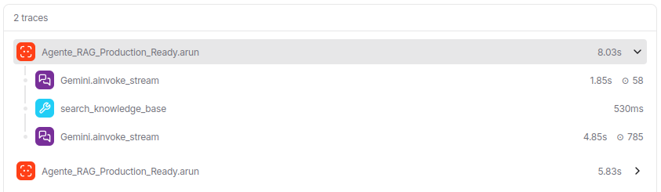

# Agente RAG com Google Gemini

Sistema de RAG (Retrieval-Augmented Generation) avançado com observabilidade, segurança (Guardrails) e interface UI, utilizando Agno framework, Google Gemini 2.5 Flash e LanceDB.

## Stack

- **[Agno](https://agno.com)** — Framework de orquestração de Agentes AI.
- **Google Gemini 2.5 Flash** — LLM de última geração e embeddings de alta performance.
- **LanceDB** — Vector database para busca semântica eficiente.
- **AgentOS** — Componente para orquestração de threads, UI e persistência.
- **FastAPI** — Motor de API para integração e interface web.
- **LangSmith & OpenTelemetry** — Observabilidade avançada e rastreamento de traces.
- **Pydantic Settings** — Gestão de configurações via `BaseSettings` e `.env`.

## Features

- **RAG Multi-Documento** — Indexação e busca semântica automática em múltiplos arquivos PDF.
- **Observabilidade & Tracing** — Monitoramento detalhado de cada etapa do agente com integração AgentOS e LangSmith.
- **Segurança Reforçada** — Proteção nativa contra Prompt Injection e vazamento de PII (dados sensíveis).
- **Interface UI Playground** — Servidor web embutido para interação visual com o agente.
- **Busca Iterativa (Multi-Query)** — O agente executa múltiplas consultas para garantir cobertura total.
- **Configuração Centralizada** — Controle total de modelos e parâmetros via `config.py`.
- **Persistência de Telemetria** — Armazenamento local em SQLite para auditoria.
- **Output Estruturado** — Respostas em Markdown com referências automáticas de páginas.

### Novas Features (v2)

- **Módulo de configuração centralizado (`config.py`)** — Todas as configurações do projeto (API keys, model ID, diretórios, nomes de tabela) são gerenciadas via `Pydantic BaseSettings`, permitindo fácil customização via variáveis de ambiente ou `.env`
- **Indexação automática de múltiplos PDFs** — O sistema agora escaneia automaticamente o diretório `knowledge/` e indexa todos os PDFs encontrados, com `skip_if_exists=True` para evitar reprocessamento
- **Função `setup_knowledge()` dedicada** — A lógica de criação da knowledge base foi extraída para uma função própria com type hints, melhorando a modularidade e testabilidade do código
- **Error handling por documento** — Erros durante a indexação de PDFs individuais são capturados e logados sem interromper o processamento dos demais documentos
- **Configurações externalizadas** — Model ID, diretório de knowledge, URI do LanceDB e nome da tabela são configuráveis sem alterar o código-fonte
- **Base de conhecimento expandida** — Novos documentos PDF adicionados à knowledge base para consultas mais abrangentes

### Novas Features (v2.1 - Production Ready)

Implementadas no arquivo `code_agno_telemetry.py`, estas features elevam o sistema para um ambiente de produção real:

- **Observabilidade Integrada (AgentOS)** — O monitoramento de traces e performance é realizado automaticamente pelo `AgentOS` com persistência em banco de dados SQLite.
- **AgentOS Integration** — O agente agora é gerenciado pelo `AgentOS`, permitindo escalabilidade e gestão centralizada.
- **Servidor API & UI** — Suporte para servir o agente via FastAPI e uma interface gráfica (UI) dedicada através do comando `--serve`.
- **Otimização de Busca (Multi-Query)** — Instruções avançadas que forçam o agente a realizar buscas minuciosas e repetidas com diferentes palavras-chave até cobrir toda a base.
- **Autenticação JWT Opcional** — Suporte para proteção de endpoints via `JWTMiddleware`, configurável através da `jwt_secret` no arquivo de configurações.
- **Arquitetura de Produção** — Nomeado internamente como "Production Ready", o sistema garante respostas mais precisas com referências de páginas obrigatórias e gestão automática de observabilidade.

### Novas Features (v2.2 - Security & Guardrails)

Implementada no arquivo `code_agno_telemetry.py` e centralizada no `config.py`, esta versão foca em segurança:

- **Proteção contra Prompt Injection** — Utiliza o `PromptInjectionGuardrail` nativo do Agno, configurado com uma lista abrangente de padrões de ataque.
- **Configurações Centralizadas (`config.py`)** — Adição da variável `injection_patterns`, que centraliza todos os termos e frases usados para detectar tentativas de "jailbreak" ou injeção de prompt, permitindo atualizações sem alterar a lógica do agente.
- **Segurança Proativa** — O agente agora valida a entrada do usuário contra os padrões definidos antes mesmo de processar a requisição no LLM.

## Base de Conhecimento

Documentos PDF indexados pelo agente (**4 documentos, 2.347 páginas no total**):

| Documento | Páginas |
|-----------|---------|
| `CanalSysAuto2.pdf` | 240 |
| `IA-Report-2025.pdf` | 457 |
| `Inteligência Artificial (Peter Norvig, Stuart Russell).pdf` | 1.324 |
| `Manual-de-Inteligencia-Artificial.pdf` | 326 |

## Setup

Clone e instale as dependências:

```bash
git clone https://github.com/ErickGuimaraesFerreira/agent-rag-v2.git
cd agent-rag-v2

# Com UV
uv venv && source .venv/bin/activate
uv pip install -e .

# Ou com pip
python -m venv .venv && source .venv/bin/activate
pip install -e .
```

Configure a API key:

```bash
cp .env.example .env
# Adicione sua GOOGLE_API_KEY no arquivo .env
```

Obtenha a key em: https://ai.google.dev/

## Uso

O projeto agora conta com duas versões:

### 1. Versão Básica
Indexa PDFs e responde perguntas via terminal:
```bash
python code.py
```

### 2. Versão Produção (v2.1)
Inclui observabilidade nativa, traces e interface gráfica (UI) via AgentOS:
```bash
# Rodar pergunta direta
python code_agno_telemetry.py "Sua pergunta"

# Iniciar servidor UI (Porta 7777)
python code_agno_telemetry.py "Pergunta Opcional" --serve
```



### Customização

Edite as queries no `code.py`:

```python
response1 = agent.run("Sua pergunta aqui")
response2 = agent.run("Outra pergunta")
```

Ajuste as configurações no `.env` ou diretamente no `config.py`:

```python
# config.py - valores padrão
model_id: str = "gemini-2.5-flash"
knowledge_dir: Path = Path("knowledge")
lancedb_uri: str = "lancedb_data"
table_name: str = "pdfs_local"
```

Ajuste as instruções do agente no `code.py`:

```python
instructions=[
    "Responda de maneira concisa e direta.",
    "Se não souber a resposta, responda que não sabe.",
    "Não utilize informações que não estejam na base de conhecimento.",
],
```

## Estrutura

```
├── code.py                # Script básico
├── code_agno_telemetry.py # Script v2.1 (Produção + Observabilidade)
├── config.py              # Configurações centralizadas (Pydantic Settings)
├── knowledge/             # PDFs para indexação (auto-descoberta)
├── .env                   # API keys (não commitado)
├── pyproject.toml         # Dependências
└── README.md
```

## Implementação

O código segue uma arquitetura modular e orientada a objetos:

1. **Configuração (`config.py`)** — Pydantic BaseSettings gerencia chaves, modelos e agora **padrões de segurança (injection patterns)** centralizados.
2. **Setup Knowledge** — Função dedicada que inicializa LanceDB, escaneia PDFs e gerencia a indexação com bypass de duplicatas.
3. **Agent Architecture** — O agente utiliza instruções avançadas para busca multi-query e **pre-hooks de segurança**.
4. **AgentOS & Observabilidade** — Utiliza `AgentOS` para orquestração e monitoramento automático de traces.
5. **Segurança & Guardrails** — Implementação de `PromptInjectionGuardrail` no arquivo principal de telemetria, garantindo que ataques sejam bloqueados na entrada.
6. **Entry Point** — Suporte híbrido para execução CLI ou Servidor FastAPI/UI.

Principais componentes:

- `Settings` — Gestão de ambiente.
- `setup_knowledge()` — Gestão de Vector DB.
- `AgentOS` — Orquestração e UI.
- `main()` — CLI interface com modo `--serve`.

## Output

Exemplo de execução:

```
2026-02-11 22:00:00 | INFO | Agente RAG iniciado...
2026-02-11 22:00:02 | INFO | Encontrados 4 documentos. Iniciando indexação...
2026-02-11 22:00:05 | INFO | Processado o IA-Report-2025.pdf
2026-02-11 22:00:08 | INFO | Processado o Manual-de-Inteligencia-Artificial.pdf
2026-02-11 22:00:10 | INFO | Agente criado
2026-02-11 22:00:15 | INFO | Relatório salvo em response_investimentos.md
```

## Licença

MIT

---

**Erick Guimarães Ferreira** | [GitHub](https://github.com/ErickGuimaraesFerreira)
